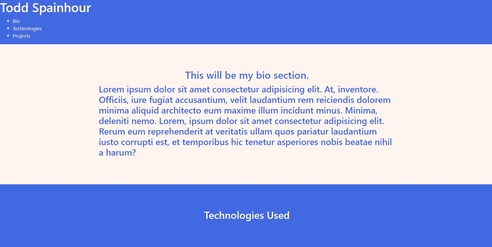

# Title: Personal Bio Site 

## Description: In this project, I created a personalized portfolio site with the purpose of sharing my projects and resume. 

## Screenshots

## How To Run
1. Clone down this repo.
1. Make sure you have http-server installed via npm. If you don't have npm, get it here. (https://www.npmjs.com/package/http-server) 
1. On your command line, run `hs -p 8080`
1. In your browser, go to `http://localhost:8080/`